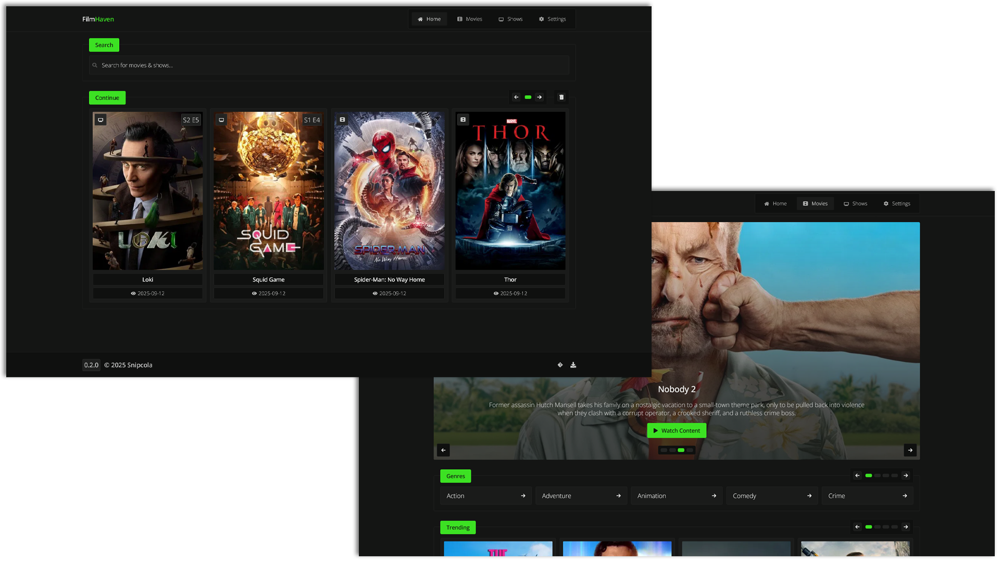

# FilmHaven

A simple, customizable, and lightweight frontend to view and interact with movies & shows.

**Accessible here:**

- [watch.snipcola.com](https://watch.snipcola.com)
- [film-haven.vercel.app](https://film-haven.vercel.app)

## Note

Due to the nature of how the project works, you might face ads upon viewing content; to fix this, use [uBlock Origin](https://ublockorigin.com), [AdGuard](https://adguard.com), or an ad-blocker of your choice.

## Shortcuts

- `/` - Focuses on search bar. _Navigates out out of any page or modal open._
- `[` - Plays previous episode, _if exists_. _Only works on series modal._
- `]` - Plays next episode, _if exists_. _Only works on series modal._
- `- or =` - Sets previous provider, _if exists_. _Only works on movie or series modal._
- `+` - Sets next provider, _if exists_. _Only works on movie or series modal._
- `r` - Refreshes video. _Only works on movie or series modal._
- `v` - Focuses on video. _Only works on movie or series modal._
- `x` - Closes modal. _Only works when modal is open._

## Custom Providers

To add a custom provider, navigate to the `Settings` page and press the `Edit` button under the `Providers` section.

The movie/series url will be formatted and have replacements performed, such as:

- `%b` -> base (e.g. `example.org`, you'll provide this)
- `%i` -> id
- `%i2` -> imdb id
- `%s` -> season
- `%e` -> episode

Example of a movie url: `https://%b/embed/movie/%i` 
Example of a series url: `https://%b/embed/tv/%i/%s/%e`

## Compilation

1. Ensure you have `bun` installed.
2. Run `bun install`.
3. Run `bun run build` or `bun run dev` depending on what you need.
4. Access the site at `out/index.html`.

## ⚠️ Disclaimer

All files, such as media, are linked from third-party services, which this project is not responsible for and has no control over.
